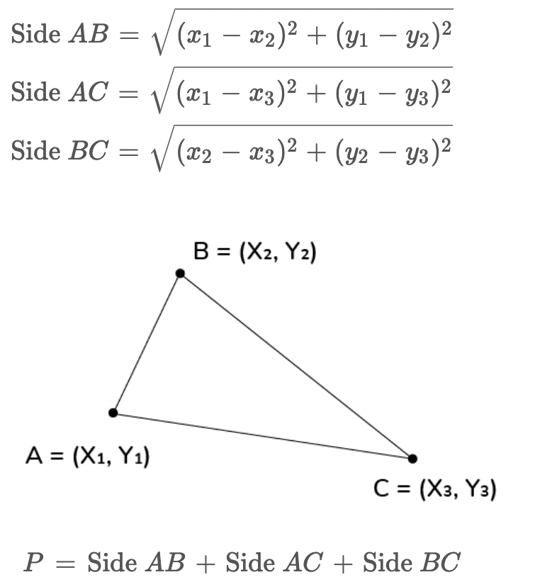

<!-- ABOUT THE PROJECT -->
## About The Project

This series of katas will introduce you to basics of doing geometry with computers.

Point objects have x, y attributes. Triangle objects have attributes a, b, c describing their corners, each of them is a Point.

Write a function calculating perimeter of a Triangle defined this way.

Tests round answers to 6 decimal places.

### Built With

This section lists all major frameworks/libraries used to bootstrap this project.

* [![JavaScript][JavaScript]][JavaScript-url]
* [![NodeJS][NodeJS]][NodeJS-url]
* [![Jest][Jest]][Jest-url]

<p align="right">(<a href="#readme-top">back to top</a>)</p>

### Design
Formula for the perimeter of triangle with vertices


### Prerequisites

Below is the list things you need to use the software and how to install them.  Note, these instructions assume you are using a Mac OS.  If you are using Windows you will need to go through these instructions yourself and update this READ for future users.

1. Download [NodeJS](https://nodejs.org/en/download/)
2. Jest
   ```sh
   npm install
   ```

<!-- USAGE EXAMPLES -->
## Usage

In order to run these test cases execute the following command.

 ```sh
   npm test
   ```

<!-- CONTRIBUTING -->
## Contributing

Contributions are what make the open source community such an amazing place to learn, inspire, and create. Any contributions you make are **greatly appreciated**.

If you have a suggestion that would make this better, please fork the repo and create a pull request. You can also simply open an issue with the tag "enhancement".
Don't forget to give the project a star! Thanks again!

1. Fork the Project
2. Create your Feature Branch (`git checkout -b feature/AmazingFeature`)
3. Commit your Changes (`git commit -m 'Add some AmazingFeature'`)
4. Push to the Branch (`git push origin feature/AmazingFeature`)
5. Open a Pull Request

<p align="right">(<a href="#readme-top">back to top</a>)</p>


<!-- LICENSE -->
## License

Distributed under the MIT License. See `LICENSE.txt` for more information.

<p align="right">(<a href="#readme-top">back to top</a>)</p>


<!-- CONTACT -->
## Contact

Your Name - [@realfintorian](https://twitter.com/realfintorian) - johnson.larry.l@fintorian.com

Project Link: [https://github.com/johnsonlarryl/machine_learning_training](https://github.com/your_username/repo_name)

<p align="right">(<a href="#readme-top">back to top</a>)</p>


<!-- ACKNOWLEDGMENTS -->
## Acknowledgments

* [Codewars](https://www.codewars.com/kata/58e3e62f20617b6d7700120a/train/javascript)

<p align="right">(<a href="#readme-top">back to top</a>)</p>


<!-- MARKDOWN LINKS & IMAGES -->
<!-- https://www.markdownguide.org/basic-syntax/#reference-style-links -->
[JavaScript-url]:https://www.ecma-international.org/publications-and-standards/standards/ecma-262/
[JavaScript]:https://img.shields.io/badge/JavaScript-F7DF1E?style=for-the-badge&logo=javascript&logoColor=black
[NodeJS-url]:https://nodejs.org/
[NodeJS]:https://img.shields.io/badge/node.js-6DA55F?style=for-the-badge&logo=node.js&logoColor=white
[Jest-url]:https://jestjs.io/
[Jest]:https://img.shields.io/badge/-jest-%23C21325?style=for-the-badge&logo=jest&logoColor=white
